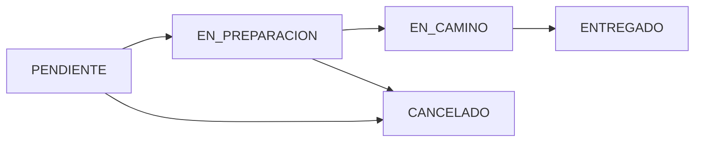

# 🍔 QuickBite - API REST de Delivery de Comida


## 📋 Descripción del Proyecto

**QuickBite** es una API REST completa desarrollada con Spring Boot para la gestión de un sistema de delivery de comida. El sistema permite gestionar restaurantes, productos, pedidos, clientes y repartidores, implementando un flujo completo de negocio con autenticación JWT y reglas de negocio robustas.

### 🎯 Objetivos de Aprendizaje Cumplidos

- ✅ Diseño de modelos de datos relacionales complejos con JPA
- ✅ Implementación de lógica de negocio con validaciones y excepciones
- ✅ Optimización del acceso a datos mediante paginación y consultas JPQL
- ✅ Arquitectura profesional en capas (Controller → Service → Repository)
- ✅ Sistema de autenticación y autorización con JWT
- ✅ Uso de DTOs y MapStruct para desacoplar la API de la base de datos

---

## 🏗️ Arquitectura del Sistema

```
┌─────────────────────────────────────────────────────────┐
│                    CAPA CONTROLLER                       │
│  (@RestController - Recibe peticiones HTTP)              │
│  AuthController, ProductoController, PedidoController... │
└────────────────────┬────────────────────────────────────┘
                     │
                     ▼
┌─────────────────────────────────────────────────────────┐
│                     CAPA SERVICE                         │
│  (@Service - Lógica de negocio y validaciones)          │
│  ProductoService, PedidoService, ClienteService...       │
└────────────────────┬────────────────────────────────────┘
                     │
                     ▼
┌─────────────────────────────────────────────────────────┐
│                   CAPA REPOSITORY                        │
│  (@Repository - Acceso a datos con JPA)                 │
│  ProductoRepository, PedidoRepository...                 │
└────────────────────┬────────────────────────────────────┘
                     │
                     ▼
            ┌────────────────┐
            │   MARIADB      │
            │  QuickBite_db  │
            └────────────────┘
```

---

## 📊 Diagrama de Entidades (ERD)

```
┌──────────────┐           ┌──────────────┐
│   Usuario    │           │  Categoria   │
├──────────────┤           ├──────────────┤
│ id (PK)      │           │ id (PK)      │
│ username     │           │ nombre       │
│ email        │           │ descripcion  │
│ password     │           └──────┬───────┘
│ role         │                  │
│ activo       │                  │ 1
└──────┬───────┘                  │
       │ 1:1                      │
       │                          │
┌──────▼───────┐                  │
│   Cliente    │                  │
├──────────────┤                  │
│ id (PK)      │                  │
│ usuario_id   │                  │
│ telefono     │                  │
│ direccion    │                  │
└──────┬───────┘                  │
       │ 1                        │
       │                          │
       │ N                        │
┌──────▼───────────┐              │
│     Pedido       │              │
├──────────────────┤              │
│ id (PK)          │              │
│ cliente_id (FK)  │              │
│ repartidor_id    │              │ N
│ fechaPedido      │    ┌─────────▼──────────┐
│ estado           │    │     Producto       │
│ total            │    ├────────────────────┤
│ direccionEntrega │    │ id (PK)            │
└────────┬─────────┘    │ nombre             │
         │ 1            │ precio             │
         │              │ stock              │
         │ N            │ restaurante_id(FK) │
┌────────▼──────────┐   │ categoria_id (FK)  │
│  DetallePedido    │   └────────────────────┘
├───────────────────┤            ▲
│ id (PK)           │            │ N
│ pedido_id (FK)    │            │
│ producto_id (FK)  │            │ 1
│ cantidad          │   ┌────────┴──────────┐
│ precioUnitario    │   │   Restaurante     │
│ subtotal          │   ├───────────────────┤
└───────────────────┘   │ id (PK)           │
                        │ nombre            │
┌──────────────┐        │ direccion         │
│ Repartidor   │        │ telefono          │
├──────────────┤        │ activo            │
│ id (PK)      │        └───────────────────┘
│ nombre       │
│ email        │
│ matricula    │
│ activo       │
└──────┬───────┘
       │ 1
       │
       │ N (a Pedido)
```

### 🔗 Relaciones Implementadas

| Tipo | Relación | Descripción |
|------|----------|-------------|
| **1:1** | Usuario ↔ Cliente | Cada usuario tiene un único perfil de cliente |
| **1:N** | Restaurante → Producto | Un restaurante tiene muchos productos |
| **1:N** | Categoria → Producto | Una categoría agrupa muchos productos |
| **1:N** | Cliente → Pedido | Un cliente puede tener múltiples pedidos |
| **1:N** | Repartidor → Pedido | Un repartidor gestiona múltiples pedidos |
| **1:N** | Pedido → DetallePedido | Un pedido contiene múltiples detalles |
| **N:M** | Pedido ↔ Producto | Relación implícita a través de DetallePedido |

---

## 🚀 Tecnologías Utilizadas

### Backend
- **Java 17** - Lenguaje de programación
- **Spring Boot 3.x** - Framework principal
- **Spring Data JPA** - Persistencia de datos
- **Hibernate** - ORM
- **Spring Security** - Seguridad y autenticación
- **JWT (JSON Web Tokens)** - Autenticación stateless
- **MapStruct** - Mapeo automático de DTOs
- **Lombok** - Reducción de código boilerplate
- **Maven** - Gestión de dependencias

### Base de Datos
- **MariaDB 10.x** - Base de datos relacional

### Validación y Testing
- **Jakarta Validation (Bean Validation 3.0)** - Validaciones
- **SLF4J + Logback** - Logging

---

## 📁 Estructura del Proyecto

```
src/main/java/org/example/quickbite/
│
├── config/                      # Configuración
│   ├── CorsConfig.java         # CORS
│   ├── SecurityConfig.java     # Spring Security
│   ├── JwtAuthenticationFilter.java
│   └── WebConfig.java
│
├── controller/                  # Controladores REST
│   ├── AuthController.java
│   ├── ProductoController.java
│   ├── PedidoController.java
│   ├── ClienteController.java
│   ├── RestauranteController.java
│   ├── RepartidorController.java
│   └── CategoriaController.java
│
├── service/                     # Lógica de negocio
│   ├── AuthService.java
│   ├── ProductoService.java
│   ├── PedidoService.java
│   ├── ClienteService.java
│   ├── RestauranteService.java
│   ├── RepartidorService.java
│   ├── JwtService.java
│   └── CustomUserDetailsService.java
│
├── repository/                  # Acceso a datos
│   ├── ProductoRepository.java
│   ├── PedidoRepository.java
│   ├── ClienteRepository.java
│   ├── RestauranteRepository.java
│   ├── RepartidorRepository.java
│   ├── CategoriaRepository.java
│   └── UsuarioRepository.java
│
├── model/                       # Entidades JPA
│   ├── Usuario.java
│   ├── Cliente.java
│   ├── Producto.java
│   ├── Pedido.java
│   ├── DetallePedido.java
│   ├── Restaurante.java
│   ├── Repartidor.java
│   └── Categoria.java
│
├── dto/                         # Data Transfer Objects
│   ├── request/                # DTOs de entrada
│   │   ├── LoginRequest.java
│   │   ├── RegisterRequest.java
│   │   ├── ProductoFormDTO.java
│   │   └── PedidoFormDTO.java
│   └── response/               # DTOs de salida
│       ├── AuthResponse.java
│       ├── ProductoDetalleDTO.java
│       └── PedidoListaDTO.java
│
├── mapper/                      # MapStruct Mappers
│   ├── ProductoMapper.java
│   ├── PedidoMapper.java
│   └── ClienteMapper.java
│
└── exception/                   # Manejo de excepciones
    ├── GlobalExceptionHandler.java
    ├── ResourceNotFoundException.java
    └── BusinessException.java
```

---

## 🔐 Sistema de Seguridad

### Autenticación JWT

El sistema utiliza **JWT (JSON Web Tokens)** para autenticación stateless:

1. El usuario se registra o hace login
2. El servidor genera un token JWT firmado
3. El cliente envía el token en cada petición: `Authorization: Bearer <token>`
4. El servidor valida el token y autoriza la petición

### Roles de Usuario

| Rol | Permisos |
|-----|----------|
| **USER** | Ver productos, crear pedidos, ver su perfil |
| **ADMIN** | Gestión completa de productos, restaurantes, clientes, repartidores |

---

## 📡 Endpoints Principales

### 🔑 Autenticación
```http
POST   /api/auth/register    # Registrar nuevo usuario
POST   /api/auth/login       # Iniciar sesión
```

### 🍕 Productos
```http
GET    /api/productos                     # Listar productos (paginado)
GET    /api/productos/{id}                # Obtener producto por ID
POST   /api/productos                     # Crear producto (ADMIN)
PUT    /api/productos/{id}                # Actualizar producto (ADMIN)
DELETE /api/productos/{id}                # Eliminar producto (ADMIN)
GET    /api/productos/filtrar             # Buscar con filtros (paginado)
PATCH  /api/productos/{id}/stock          # Actualizar stock (ADMIN)
```

**Parámetros de paginación:**
- `page` (default: 0)
- `size` (default: 10)
- `sortBy` (default: id)

**Parámetros de filtrado:**
- `restauranteId` - Filtrar por restaurante
- `categoriaId` - Filtrar por categoría
- `disponible` - Filtrar por disponibilidad

### 📦 Pedidos
```http
GET    /api/pedidos                       # Listar todos (ADMIN)
GET    /api/pedidos/mis-pedidos           # Pedidos del usuario autenticado
GET    /api/pedidos/{id}                  # Obtener pedido por ID
POST   /api/pedidos                       # Crear nuevo pedido
PATCH  /api/pedidos/{id}/estado           # Actualizar estado
PATCH  /api/pedidos/{id}/asignar-repartidor  # Asignar repartidor
DELETE /api/pedidos/{id}                  # Eliminar pedido
GET    /api/pedidos/sin-repartidor        # Listar pedidos sin asignar
```

### 👥 Clientes
```http
GET    /api/clientes                      # Listar clientes (ADMIN)
GET    /api/clientes/{id}                 # Obtener cliente por ID (ADMIN)
GET    /api/clientes/mi-perfil            # Ver mi perfil
PUT    /api/clientes/{id}                 # Actualizar cliente (ADMIN)
DELETE /api/clientes/{id}                 # Eliminar cliente (ADMIN)
GET    /api/clientes/buscar?texto=        # Buscar clientes (ADMIN)
```

### 🏪 Restaurantes
```http
GET    /api/restaurantes                  # Listar restaurantes
GET    /api/restaurantes/{id}             # Obtener restaurante
POST   /api/restaurantes                  # Crear restaurante (ADMIN)
PUT    /api/restaurantes/{id}             # Actualizar restaurante (ADMIN)
DELETE /api/restaurantes/{id}             # Eliminar restaurante (ADMIN)
```

### 🚴 Repartidores
```http
GET    /api/repartidores                  # Listar repartidores (ADMIN)
GET    /api/repartidores/activos          # Listar activos (ADMIN)
GET    /api/repartidores/{id}             # Obtener repartidor (ADMIN)
POST   /api/repartidores                  # Crear repartidor (ADMIN)
PUT    /api/repartidores/{id}             # Actualizar repartidor (ADMIN)
PATCH  /api/repartidores/{id}/estado      # Cambiar estado (ADMIN)
DELETE /api/repartidores/{id}             # Eliminar repartidor (ADMIN)
```

### 📂 Categorías
```http
GET    /api/categorias                    # Listar categorías
GET    /api/categorias/{id}               # Obtener categoría
POST   /api/categorias                    # Crear categoría
PUT    /api/categorias/{id}               # Actualizar categoría
DELETE /api/categorias/{id}               # Eliminar categoría
```

---

## 📄 Sistema de Paginación

### ¿Cómo funciona la paginación?

Todos los endpoints de listado implementan **paginación automática** usando `Pageable` de Spring Data.

### Ejemplo de Request

```http
GET http://localhost:8080/api/productos?page=0&size=5&sortBy=nombre
```

### Parámetros

| Parámetro | Tipo | Default | Descripción |
|-----------|------|---------|-------------|
| `page` | int | 0 | Número de página (empieza en 0) |
| `size` | int | 10 | Cantidad de elementos por página |
| `sortBy` | string | id | Campo por el cual ordenar |

### Ejemplo de Response

```json
{
  "content": [
    {
      "id": 1,
      "nombre": "Pizza Margarita",
      "precio": 12.50,
      "disponible": true,
      "stock": 15,
      "restauranteNombre": "Pizzería Italiana",
      "categoriaNombre": "Pizzas"
    },
    {
      "id": 2,
      "nombre": "Hamburguesa Clásica",
      "precio": 8.99,
      "disponible": true,
      "stock": 20,
      "restauranteNombre": "Burger House",
      "categoriaNombre": "Hamburguesas"
    }
  ],
  "pageable": {
    "sort": {
      "sorted": true,
      "unsorted": false,
      "empty": false
    },
    "pageNumber": 0,
    "pageSize": 5,
    "offset": 0,
    "paged": true,
    "unpaged": false
  },
  "totalPages": 3,
  "totalElements": 15,
  "last": false,
  "first": true,
  "number": 0,
  "numberOfElements": 5,
  "size": 5,
  "sort": {
    "sorted": true,
    "unsorted": false,
    "empty": false
  },
  "empty": false
}
```

### Campos de Respuesta Importantes

| Campo | Descripción |
|-------|-------------|
| `content` | Array con los elementos de la página actual |
| `totalPages` | Total de páginas disponibles |
| `totalElements` | Total de elementos en la base de datos |
| `number` | Número de página actual (0-indexed) |
| `size` | Tamaño de página configurado |
| `first` | `true` si es la primera página |
| `last` | `true` si es la última página |

### Endpoints con Paginación

✅ Todos los endpoints de listado implementan paginación:

- `GET /api/productos`
- `GET /api/productos/filtrar`
- `GET /api/pedidos`
- `GET /api/pedidos/mis-pedidos`
- `GET /api/clientes`
- `GET /api/restaurantes`
- `GET /api/repartidores`

### Implementación en el Código

**Controller:**
```java
@GetMapping
public ResponseEntity<Page<ProductoListaDTO>> listarTodos(
        @RequestParam(defaultValue = "0") int page,
        @RequestParam(defaultValue = "10") int size,
        @RequestParam(defaultValue = "id") String sortBy) {
    
    Pageable pageable = PageRequest.of(page, size, Sort.by(sortBy));
    Page<ProductoListaDTO> productos = productoService.listarTodos(pageable);
    return ResponseEntity.ok(productos);
}
```

**Service:**
```java
public Page<ProductoListaDTO> listarTodos(Pageable pageable) {
    Page<Producto> productos = productoRepository.findAll(pageable);
    return productos.map(productoMapper::toListaDTO);
}
```

**Repository:**
```java
@EntityGraph(attributePaths = {"restaurante", "categoria"})
Page<Producto> findAll(Pageable pageable);
```

---

## 🎯 Reglas de Negocio Implementadas

### 1. Límite de Pedidos Activos por Cliente
**Regla:** Un cliente no puede tener más de 3 pedidos activos (PENDIENTE, EN_PREPARACION, EN_CAMINO) simultáneamente.

**Implementación:** `PedidoService.crearPedidoParaUsuario()`
```java
Long pedidosActivos = pedidoRepository.contarPedidosActivosDelCliente(cliente.getId());
if (pedidosActivos >= MAX_PEDIDOS_ACTIVOS) {
    throw new BusinessException(
        "Ya tienes 3 pedidos activos. No puedes realizar más pedidos."
    );
}
```

### 2. Productos del Mismo Restaurante
**Regla:** Todos los productos de un pedido deben pertenecer al mismo restaurante.

**Implementación:** `PedidoService.crearPedidoParaUsuario()`
```java
Set<Long> restaurantesIds = new HashSet<>();
for (DetallePedidoFormDTO detalleDTO : dto.getDetalles()) {
    Producto producto = productoRepository.findById(detalleDTO.getProductoId())
        .orElseThrow(/* ... */);
    restaurantesIds.add(producto.getRestaurante().getId());
}

if (restaurantesIds.size() > 1) {
    throw new BusinessException(
        "No puedes pedir productos de diferentes restaurantes."
    );
}
```

### 3. Validación de Stock
**Regla:** No se puede crear un pedido si no hay stock suficiente.

**Implementación:**
```java
if (producto.getStock() < detalleDTO.getCantidad()) {
    throw new BusinessException(
        "Stock insuficiente para el producto '" + producto.getNombre() + "'"
    );
}
```

### 4. Reducción Automática de Stock
**Regla:** Al crear un pedido, el stock se reduce automáticamente.

**Implementación:** `Producto.reducirStock()`
```java
public void reducirStock(int cantidad) {
    if (this.stock >= cantidad) {
        this.stock -= cantidad;
        if (this.stock == 0) {
            this.disponible = false;
        }
    } else {
        throw new IllegalStateException("Stock insuficiente");
    }
}
```

### 5. Asignación Automática de Repartidor
**Regla:** Al crear un pedido, se asigna automáticamente el repartidor con menos carga de trabajo.

**Implementación:** `PedidoService.asignarRepartidorAutomatico()`
```java
private Repartidor asignarRepartidorAutomatico() {
    List<Repartidor> repartidoresActivos = repartidorRepository.findByActivoTrue();
    
    Repartidor mejorRepartidor = null;
    long menorCarga = Long.MAX_VALUE;
    
    for (Repartidor repartidor : repartidoresActivos) {
        Long pedidosEnCamino = pedidoRepository
            .contarPedidosEnCaminoDelRepartidor(repartidor.getId());
        
        if (pedidosEnCamino < MAX_PEDIDOS_EN_CAMINO 
            && pedidosEnCamino < menorCarga) {
            menorCarga = pedidosEnCamino;
            mejorRepartidor = repartidor;
        }
    }
    
    return mejorRepartidor;
}
```

### 6. Límite de Entregas por Repartidor
**Regla:** Un repartidor no puede tener más de 5 pedidos EN_CAMINO simultáneamente.

**Implementación:** `PedidoService.asignarRepartidor()`
```java
Long pedidosEnCamino = pedidoRepository
    .contarPedidosEnCaminoDelRepartidor(repartidorId);
    
if (pedidosEnCamino >= MAX_PEDIDOS_EN_CAMINO) {
    throw new BusinessException(
        "El repartidor ya tiene 5 pedidos en camino."
    );
}
```

---

## 🔍 Consultas Avanzadas con Filtros

### Búsqueda de Productos con Filtros Múltiples

**Endpoint:**
```http
GET /api/productos/filtrar?restauranteId=1&categoriaId=2&disponible=true&page=0&size=5
```

**Implementación (ProductoRepository):**
```java
@EntityGraph(attributePaths = {"restaurante", "categoria"})
@Query("SELECT p FROM Producto p WHERE " +
       "(:restauranteId IS NULL OR p.restaurante.id = :restauranteId) AND " +
       "(:categoriaId IS NULL OR p.categoria.id = :categoriaId) AND " +
       "(:disponible IS NULL OR p.disponible = :disponible)")
Page<Producto> buscarConFiltros(
    @Param("restauranteId") Long restauranteId,
    @Param("categoriaId") Long categoriaId,
    @Param("disponible") Boolean disponible,
    Pageable pageable
);
```

**Características:**
- ✅ Filtros opcionales (si el parámetro es `null`, no se aplica)
- ✅ Paginación integrada
- ✅ Uso de `@EntityGraph` para optimizar consultas (evitar N+1)
- ✅ JPQL personalizado

### Búsqueda de Clientes por Texto

**Endpoint:**
```http
GET /api/clientes/buscar?texto=Juan&page=0&size=10
```

**Implementación (ClienteRepository):**
```java
@EntityGraph(attributePaths = {"usuario"})
@Query("SELECT c FROM Cliente c WHERE " +
       "LOWER(c.usuario.nombre) LIKE LOWER(CONCAT('%', :texto, '%')) OR " +
       "LOWER(c.usuario.apellidos) LIKE LOWER(CONCAT('%', :texto, '%'))")
Page<Cliente> buscarPorNombreOApellidos(
    @Param("texto") String texto, 
    Pageable pageable
);
```

### Pedidos por Cliente y Estado

**Endpoint:**
```http
GET /api/pedidos/cliente/1?estado=ENTREGADO&page=0&size=10
```

**Implementación (PedidoRepository):**
```java
@EntityGraph(attributePaths = {"cliente", "cliente.usuario", "repartidor"})
@Query("SELECT p FROM Pedido p WHERE " +
       "p.cliente.id = :clienteId AND " +
       "(:estado IS NULL OR p.estado = :estado)")
Page<Pedido> buscarPorClienteYEstado(
    @Param("clienteId") Long clienteId,
    @Param("estado") Pedido.EstadoPedido estado,
    Pageable pageable
);
```

---

## ⚙️ Instalación y Configuración

### Requisitos Previos

- ☕ **Java 17** o superior
- 🗄️ **MariaDB 10.x** o **MySQL 8.x**
- 📦 **Maven 3.8+**
- 🔧 **Postman** (para probar la API)

### Pasos de Instalación

#### 1️⃣ Clonar el repositorio

```bash
git clone https://github.com/tu-usuario/quickbite.git
cd quickbite
```

#### 2️⃣ Crear la base de datos

```sql
CREATE DATABASE QuickBite_db CHARACTER SET utf8mb4 COLLATE utf8mb4_unicode_ci;
```

#### 3️⃣ Configurar application.properties

Edita `src/main/resources/application.properties`:

```properties
# Base de datos MariaDB
spring.datasource.url=jdbc:mariadb://localhost:3306/QuickBite_db
spring.datasource.username=root
spring.datasource.password=TU_PASSWORD
spring.datasource.driver-class-name=org.mariadb.jdbc.Driver

# JPA/Hibernate
spring.jpa.hibernate.ddl-auto=update
spring.jpa.show-sql=true

# Servidor
server.port=8080

# JWT Configuration
jwt.secret=404E635266556A586E3272357538782F413F4428472B4B6250645367566B5970
jwt.expiration=86400000
```

#### 4️⃣ Compilar el proyecto

```bash
mvn clean install
```

#### 5️⃣ Ejecutar la aplicación

```bash
mvn spring-boot:run
```

O ejecutar el JAR generado:

```bash
java -jar target/quickbite-0.0.1-SNAPSHOT.jar
```

#### 6️⃣ Verificar que funciona

Abre tu navegador en:
```
http://localhost:8080
```

---

## 🧪 Pruebas con Postman

### 1. Registro de Usuario

**Request:**
```http
POST http://localhost:8080/api/auth/register
Content-Type: application/json

{
  "username": "juan123",
  "email": "juan@example.com",
  "password": "123456",
  "nombre": "Juan",
  "apellidos": "Pérez García",
  "telefono": "612345678"
}
```

**Response esperada (201 Created):**
```json
{
  "token": "eyJhbGciOiJIUzI1NiJ9...",
  "username": "juan123",
  "email": "juan@example.com",
  "role": "USER",
  "mensaje": "Usuario registrado exitosamente"
}
```

### 2. Login

**Request:**
```http
POST http://localhost:8080/api/auth/login
Content-Type: application/json

{
  "username": "juan123",
  "password": "123456"
}
```

**Response esperada (200 OK):**
```json
{
  "token": "eyJhbGciOiJIUzI1NiJ9...",
  "username": "juan123",
  "email": "juan@example.com",
  "role": "USER",
  "mensaje": "Login exitoso"
}
```

**⚠️ IMPORTANTE:** Copia el `token` y úsalo en todas las peticiones posteriores.

### 3. Listar Productos (Paginado)

**Request:**
```http
GET http://localhost:8080/api/productos?page=0&size=5&sortBy=nombre
Authorization: Bearer <TU_TOKEN_AQUI>
```

**Response esperada (200 OK):**
```json
{
  "content": [
    {
      "id": 1,
      "nombre": "Pizza Margarita",
      "precio": 12.50,
      "disponible": true,
      "stock": 15,
      "restauranteNombre": "Pizzería Italiana",
      "categoriaNombre": "Pizzas"
    }
  ],
  "totalPages": 3,
  "totalElements": 15,
  "size": 5,
  "number": 0
}
```

### 4. Crear un Pedido

**Request:**
```http
POST http://localhost:8080/api/pedidos
Authorization: Bearer <TU_TOKEN_AQUI>
Content-Type: application/json

{
  "observaciones": "Sin cebolla, por favor",
  "detalles": [
    {
      "productoId": 1,
      "cantidad": 2
    },
    {
      "productoId": 3,
      "cantidad": 1
    }
  ],
  "direccionEntrega": "Calle Mayor 123",
  "ciudadEntrega": "Madrid",
  "codigoPostalEntrega": "28013",
  "provinciaEntrega": "Madrid",
  "paisEntrega": "España"
}
```

### 5. Demostración de Regla de Negocio (Error Esperado)

**Escenario:** Intentar crear un pedido con productos de diferentes restaurantes

**Request:**
```http
POST http://localhost:8080/api/pedidos
Authorization: Bearer <TU_TOKEN_AQUI>
Content-Type: application/json

{
  "detalles": [
    {
      "productoId": 1,  // Restaurante A
      "cantidad": 1
    },
    {
      "productoId": 5,  // Restaurante B
      "cantidad": 1
    }
  ],
  "direccionEntrega": "Calle Mayor 123",
  "ciudadEntrega": "Madrid",
  "codigoPostalEntrega": "28013",
  "provinciaEntrega": "Madrid"
}
```

**Response esperada (400 Bad Request):**
```json
{
  "timestamp": "2026-02-03T10:30:00",
  "status": 400,
  "error": "Business Rule Violation",
  "message": "No puedes pedir productos de diferentes restaurantes en el mismo pedido. Por favor, realiza pedidos separados para cada restaurante."
}
```

---

## 🎬 Video de Demostración

### Estructura del Video (5 minutos)

#### 1. Presentación (30 segundos)
> "Hola, soy [Tu Nombre], y presento **QuickBite**, una API REST de delivery de comida desarrollada con Spring Boot."

#### 2. Demostración en Postman (3 minutos)

**A. Registro y Login (30 seg)**
- POST /api/auth/register → Mostrar 201 Created
- POST /api/auth/login → Mostrar token JWT

**B. Paginación (30 seg)**
- GET /api/productos?page=0&size=5 → Mostrar `content`, `totalPages`, `totalElements`

**C. Creación de Pedido (30 seg)**
- POST /api/pedidos → Mostrar 201 Created con detalles

**D. Regla de Negocio (30 seg)**
- Intentar crear pedido con productos de diferentes restaurantes
- Mostrar error 400 con mensaje claro

**E. Actualización de Stock (30 seg)**
- PATCH /api/productos/{id}/stock → Mostrar actualización

**F. Filtros (30 seg)**
- GET /api/productos/filtrar?restauranteId=1&disponible=true

#### 3. Verificación en Base de Datos (1 min)
> "Ahora verifico la persistencia en MariaDB..."

```sql
SELECT * FROM usuarios;
SELECT * FROM pedidos ORDER BY fecha_pedido DESC LIMIT 5;
SELECT * FROM detalle_pedido;
SELECT * FROM productos;
```

#### 4. Cierre (30 seg)
> "Como pueden ver, el proyecto implementa todas las funcionalidades requeridas: modelo de datos completo, relaciones 1:N y N:M, paginación, reglas de negocio robustas y consultas avanzadas. ¡Gracias!"

---

## 📝 Notas Técnicas

### Optimizaciones Implementadas

#### 1. Prevención del Problema N+1
```java
@EntityGraph(attributePaths = {"restaurante", "categoria"})
Page<Producto> findAll(Pageable pageable);
```
- Carga las relaciones en una sola consulta
- Reduce drásticamente el número de queries a la BD

#### 2. Uso de DTOs
- Desacopla la API de las entidades JPA
- Previene la serialización de relaciones circulares
- Permite controlar exactamente qué datos se exponen

#### 3. Transacciones Optimizadas
```java
@Transactional(readOnly = true)  // Para consultas
public Page<ProductoListaDTO> listarTodos(Pageable pageable) { ... }

@Transactional  // Para operaciones de escritura
public ProductoDetalleDTO crear(ProductoFormDTO dto) { ... }
```

#### 4. Índices en Base de Datos
```sql
CREATE INDEX idx_producto_restaurante ON productos(restaurante_id);
CREATE INDEX idx_producto_categoria ON productos(categoria_id);
CREATE INDEX idx_pedido_cliente ON pedidos(cliente_id);
CREATE INDEX idx_pedido_estado ON pedidos(estado);
```

---

## 🐛 Manejo de Errores

### Excepciones Personalizadas

1. **ResourceNotFoundException** - Recurso no encontrado (404)
2. **BusinessException** - Violación de regla de negocio (400)

### GlobalExceptionHandler

Captura todas las excepciones y devuelve respuestas JSON consistentes:

```json
{
  "timestamp": "2026-02-03T10:30:00",
  "status": 400,
  "error": "Business Rule Violation",
  "message": "Ya tienes 3 pedidos activos. No puedes realizar más pedidos."
}
```

---

## 📊 Estados del Pedido



| Estado | Descripción |
|--------|-------------|
| PENDIENTE | Pedido creado, esperando repartidor |
| EN_PREPARACION | Repartidor asignado, restaurante preparando |
| EN_CAMINO | Pedido en ruta de entrega |
| ENTREGADO | Pedido entregado exitosamente |
| CANCELADO | Pedido cancelado |

---

## 👨‍💻 Autor

**Tu Nombre**
- 📧 Email: tu.email@example.com
- 🎓 2º Desarrollo de Aplicaciones Multiplataforma
- 📅 Proyecto Final - Acceso a Datos
- 📆 Fecha: Febrero 2026

---

## 📄 Licencia

Este proyecto fue desarrollado como proyecto educativo para el módulo de Acceso a Datos.

---

## 🙏 Agradecimientos

- Spring Boot Team por el excelente framework
- Comunidad de Stack Overflow por resolver dudas
- Profesora del módulo por la guía durante el proyecto

---

## 🚀 Próximas Mejoras (Opcionales)

- [ ] Implementar sistema de valoraciones de productos
- [ ] Añadir notificaciones en tiempo real con WebSockets
- [ ] Integración con pasarela de pago (Stripe/PayPal)
- [ ] Sistema de cupones de descuento
- [ ] Historial de pedidos con filtros avanzados
- [ ] Panel de administración con estadísticas
- [ ] Integración con API de geolocalización

---

**¡Gracias por revisar QuickBite!** 🍔🚀